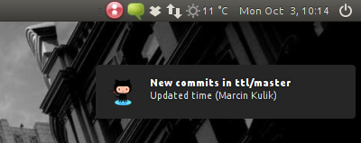
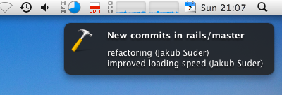
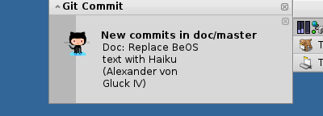

# git-dude

git-dude is a simple git desktop notifier. It monitors git repositories in
current directory for new commits/branches/tags and shows desktop notification if
anything new arrived.

## How it works

It simply uses `git fetch` and parses its output to see what has changed. Then it
formats new commit messages with `git log` and shows desktop notification with
`notify-send` / `kdialog` (Linux) or `growlnotify` (OSX). All of this in infinite loop.

## How does it look

Fedora:


Ubuntu:



OSX:



Haiku:



## Requirements

On Linux:

* `notify-send` on Gnome (Fedora: _libnotify_ package, Ubuntu: _libnotify-bin_ package)
* `kdialog` on KDE (included in KDE)

On OSX:

* `growlnotify`, from [Growl Extras](http://growl.info/extras.php#growlnotify)
  (Homebrew: _growlnotify_ package)

## Installation

```bash
$ curl -skL https://github.com/sickill/git-dude/raw/master/git-dude >~/bin/git-dude
$ chmod +x ~/bin/git-dude
```

\* Make sure `~/bin` is in your `$PATH` or put `git-dude` script somewhere else
on your `$PATH`.

### Homebrew

Git-dude can be installed with the following command:

```bash
$ brew install https://gist.github.com/lukaszkorecki/1289314/raw/022cd33fc366378552dc3527d72b994568644df1/git-dude.rb --HEAD
```

The homebrew formula lives [here](https://gist.github.com/1289314).

## Usage

git-dude iterates over repositories that live inside _the dude directory_. This
directory is nothing more than container for cloned repositories of projects
you want to watch.  Name it like you want, here for example we use
_~/.git-dude_:

```bash
$ mkdir ~/.git-dude
$ cd ~/.git-dude
```

Clone some repositories:

```bash
$ git clone --mirror https://github.com/joelthelion/autojump.git
$ git clone --mirror git://github.com/pyromaniac/hoof.git
```

I recommend `git clone --mirror` - it doesn't checkout working directory so it
saves some disk space for bigger projects.

Symlinked repositories work too. This way you can monitor already cloned
projects:

```bash
$ ln -s ~/code/tmuxinator .
```

Now run this to monitor _pwd_:

```bash
$ git dude
```

You can also pass directory name as first argument to specify which directory
to monitor instead of _pwd_.

```bash
$ git dude ~/watched-repos
```

This way you can have multiple _dude directories_ each being monitored by
separate git-dude process.

## Configuration

### Global

Set how often git-dude should check for changes (in seconds, default: 60):

```bash
$ git config --global dude.interval 30
```

Set path to icon used by desktop notifications (default: none):

```bash
$ git config --global dude.icon ~/.git-dude/github_32.png
```

Set custom notification command (`$TITLE`, `$DESCRIPTION` and `$ICON_PATH`
environment variables are set when invoking notification command):

```bash
$ git config --global dude.notify-command 'gntp-send "$TITLE" "$DESCRIPTION" "$ICON_PATH"'
$ git config --global dude.notify-command 'echo -e "$TITLE\n\n\n$DESCRIPTION" | espeak --stdin -k20 -ven+12'
```

### Per-repository

Set path to icon used by desktop notifications for this repository (default:
taken from global setting):

```bash
$ git config dude.icon ~/.git-dude/dm-core/datamapper.png
```

Tell git-dude to ignore specific repository (if you want to _unmonitor_ it):

```bash
$ git config dude.ignore true
```

## Custom upstream remote

When you have forked a repository you are likely to be more interested
in what changes happen in the upstream repository rather than your own
fork. Therefore it is possible to specify a custom remote:

    $ git config dude.remote upstream

With a Git remote configuration like below, it will monitor the
upstream repo instead of your fork:

    $ git remote -v
    origin  git@github.com:holmboe/git-dude.git (fetch)
    origin  git@github.com:holmboe/git-dude.git (push)
    upstream        git://github.com/sickill/git-dude.git (fetch)
    upstream        git://github.com/sickill/git-dude.git (push)

## Author

Marcin Kulik (http://ku1ik.com/ | @sickill)

